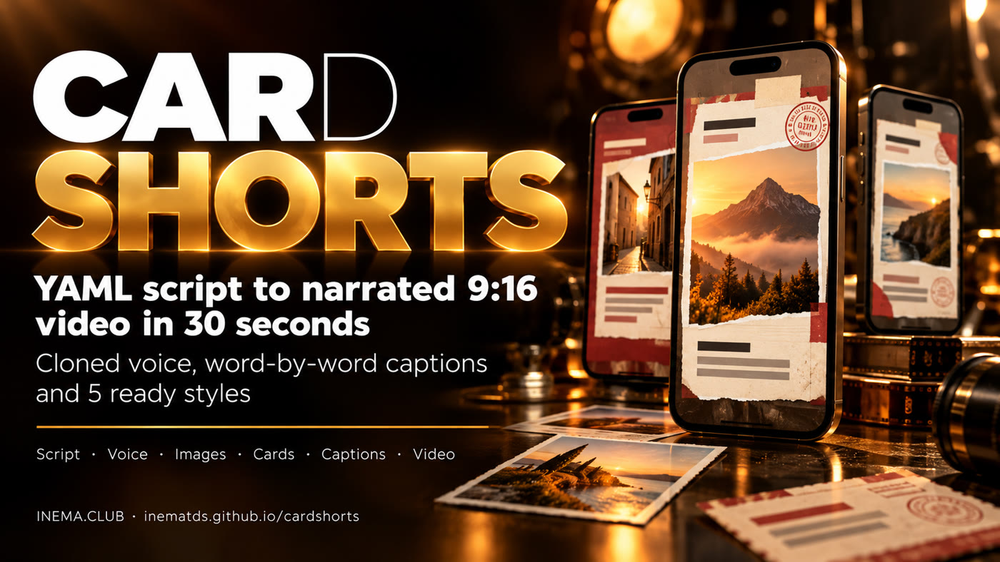

# cardshorts

[](https://inematds.github.io/cardshorts/guia/en/)

**🇧🇷 [Português](README.md) · 🇺🇸 [English](README.en.md) · 🇪🇸 [Español](README.es.md)**

## What it is

cardshorts is a command-line tool that creates short vertical videos (Reels, Shorts, TikTok) from a text file. Each scene has a spoken line and a ready-made screen (a "card"). The tool records the narration with a cloned voice, checks that the voice said it right, generates the images and delivers the MP4 with word-by-word captions, fitting in 30 seconds. It is for people who want to publish provocative videos often without editing by hand. It runs on your computer, with a graphics card and the INEMA voice and image projects installed.

## 📖 User guide

Full guide (landing + step by step): **https://inematds.github.io/cardshorts/guia/en/**

A provocative, narrated 9:16 short built from **HTML cards** — with one script file and one command.

```
roteiro.yaml ──▶ voice (local Chatterbox, cloned voice) ──▶ check by transcription (local Whisper)
             ──▶ images (local FLUX.2 klein) ──▶ cards (headless Chrome) ──▶ 1080×1920 MP4
                 with word-by-word captions, optional soundtrack and speed adjusted to fit in 30 s
```

Everything runs on your machine. Nothing paid, no external API.

## Quick use

```bash
./cardshorts.py estilos                              # available styles and templates
./cardshorts.py novo meu-video --estilo extrato      # creates meu-video/roteiro.yaml
./cardshorts.py cards meu-video/roteiro.yaml         # images + cards + previa.png only (fast)
./cardshorts.py montar meu-video/roteiro.yaml        # full video
./cardshorts.py musica musicas/minha.mp3 "calm lofi" # local soundtrack (MusicGen-small)
```

## Script

The narration is in Portuguese, so the sample lines stay in Portuguese.

```yaml
titulo: "Você × humanoides"
saida: versus.mp4
estilo: versus
max_seg: 30
legenda: true
musica: true            # musicas/tensa.mp3 or a path
voz: {ref: nei}         # <voices folder>/nei.wav
imagens:
  dupla: {prompt: "two modern faceless humanoid robots...", w: 1088, h: 640}
cenas:
  - fala: "De um lado, quem trabalha. Do outro, os humanoides."
    molde: capa-dupla
    campos: {foto_cima: "img:equipe", foto_baixo: "img:dupla", faixa: "VOCÊ × ELES", tag_cima: "...", tag_baixo: "..."}
  - fala: "..."
    html: |               # free-form card when no template fits
      <section class="card" style="background:#000">...</section>
```

Write the lines the way they are spoken: numbers spelled out, "inema ponto club".

## Styles

| style | look | templates |
|---|---|---|
| `versus` | black-and-white editorial + red | capa-dupla, tela-dividida, pergunta-foto, foto-cheia, cta-faixa, cta-lista |
| `cracha` | target, stamped ID badges, ballot | capa-mira, dois-crachas, cedula, cracha-destaque |
| `documento` | typewritten paper | capa-pergunta, formulario, aviso, formulario-preenchido, certificado |
| `extrato` | receipt / bank statement | recibo-total, recibo, recibo-carimbo, recibo-enquete |
| `celular` | phone interface | notificacao, busca, fila, enquete |

Ready-made examples in `exemplos/<estilo>/roteiro.yaml`.

## What the command ensures

- **Faithful speech:** each segment is transcribed; below 85 % similarity to the text, it generates again (up to 3×).
- **No mumbling:** cuts whatever the voice lets out after the last word.
- **Fits the time:** speeds the speech up to 1.2× to fit `max_seg`; if it does not fit, it stops and asks for a cut.
- **Cache:** voice and images are only generated again when the text/prompt changes (`.obra/`).

## Requirements

- inemavox (INEMA project) with `tts_direct.py` (Chatterbox) and `transcrever_v1.py` (Whisper)
- image server compatible with `POST /generate` (inemaimg, FLUX.2 klein)
- `ffmpeg` with libass, Playwright's Chrome headless shell, Python 3 + PyYAML
- Paths adjustable with `CS_*` variables or `config.yaml` (see the top of `cardshorts.py`)

## Skill

`skill/SKILL.md` teaches the agent (Claude Code / Codex) to use the engine with the content rules.
Install it with a link: `ln -s $PWD/skill ~/.claude/skills/cardshorts`.

Sample soundtrack generated with MusicGen-small (Meta, CC-BY-NC). Code license: MIT.
